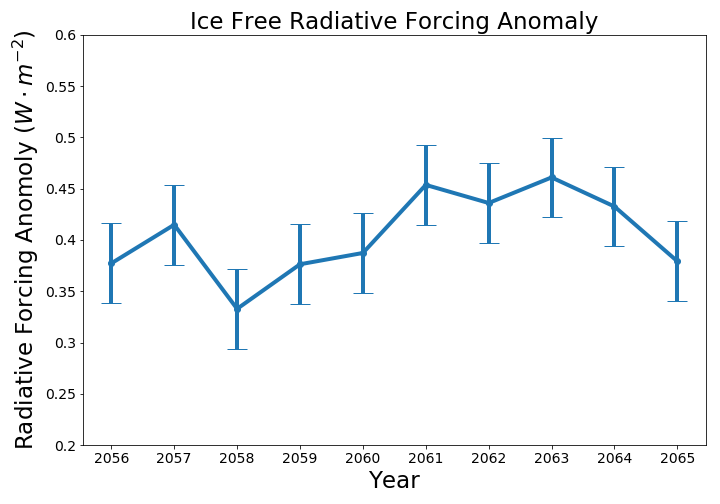

# Arctic Forcing

This repo was made for Perry Vargas's Senior Thesis for the School of Earth and
Space Exploration at Arizona State University. The point is to simply model the
affect an ice free summer has on the global annual radiative forcing. It was
found that it increased the global annual radiative forcing by $0.41\pm0.04
Wm^{-2}$

